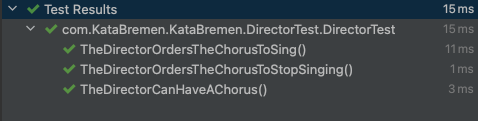

# Bremer Stadtmusikanten kata 🎶

The goal of this kata is also to practice the basic principles of OOP such as: Abstraction, Encapsulation, Inheritance, Polymorphism and Interfaces using TDD 

🚥 Test → Red → Green → Refactor 🔁
## Develop 🎤

```
Start a project at Spring Initializr
Or clone/fork this repo
Run the tests to see them pass!
```
## Tests 🎵

### Animal Test
<p align="center">

</p>

### Director Test

<p align="center">

</p>

### Comic Character Test

<p align="center">

</p>

## Rules 📋

The Bremen Town Musicians are a choir of little animals that are left to sing together:

- Cats should be started with a name and a sound they usually sing with
- At first cats don't sing
- We can tell any Cat to start singing and also to stop singing
- Cat tells us when it sings with a function returning “The cat {name} is singing {sound} ” and when it doesn't sing it will tell us “the cat {name} doesn't want to sing"
- The donkey and all the animals can do the same as the cat but its messages are “The donkey {name} is singing {sound} ” and when it does not sing it will tell us: “the donkey {name} does not want to sing”
- To direct the choir we have a director who has the ability to make several animals sing at the same time. We will instantiate this director with a list of animals and it must have the capacity of: (startSing() and stopSing()) functions in which the animals must start and stop singing regardless of their type or the number of participants in The chorus
- Suddenly we see comic characters who also sing and want to join the chorus. How can we make sure that the director can also integrate them into the chorus?

## Tools 🧰

- [Spring Boot](https://spring.io/projects/spring-boot)  
- [IntelliJ Idea](https://www.jetbrains.com/idea/) or any other IDE you like
- JAVA
